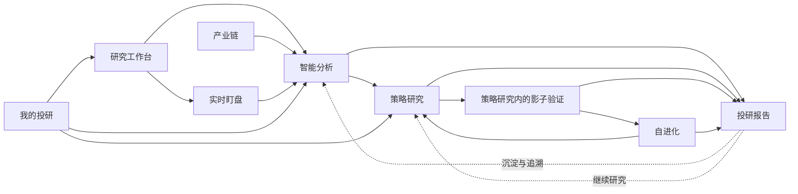

# 信息架构与研究闭环

## 1. 一级信息架构

生命周期导航采用“研究工作台 + 6 个一级业务入口”，承载 7 项业务能力：

| 分组 | 一级入口 | 产品职责 |
|---|---|---|
| 总览 | 研究工作台 | 聚合个性化事件、风险、策略和组合摘要 |
| 分析与盯盘 | 智能分析、实时盯盘 | 发现信号并形成可复核分析 |
| 策略闭环 | 策略研究、自进化 | 策略研究内部包含策略池与影子验证，从假设到纸面运行，再到受控调整 |
| 个人与图谱 | 我的投研、产业链 | 管理个人事实并研究实体关系 |

影子验证保留独立业务对象、状态和 `SHADOW-*` 需求编号，但不再拥有一级导航。全局能力不计入 6 个一级业务入口：

- `投研报告`：所有异步成果的统一入口。
- `投研助理`：当前业务页上的解释与延伸研究层。
- `设置`：模型、主题、数据与存储等低频配置。

## 2. 核心研究闭环

## 3. 页面与助手的职责边界

| 类型 | 负责 | 不负责 |
|---|---|---|
| 业务页面 | 展示真实状态、校验输入、执行固定动作、提供确定反馈 | 编造缺失数据、替模型做开放式解释 |
| 投研助理 | 以右侧停靠或近全屏浮窗理解问题、调用工具读取事实、解释并提出研究路径 | 占用智能分析一级页面、隐式修改持久业务状态、成为唯一操作入口 |
| 报告中心 | 持久记录任务结果、状态、来源和后续入口 | 代替源业务页执行全部编辑动作 |
| 设置 | 低频环境与存储配置 | 占据日常研究主流程 |

## 4. 导航规则

- 默认路由为研究工作台。
- 一级导航切换必须即时更新选中态，并保留当前模块可恢复状态。
- 从列表进入详情后，返回必须回到原筛选、滚动和选择状态。
- 跨模块跳转携带对象标识与来源，不复用不相关输入框状态。
- 打开或关闭助理不得改变业务路由、丢失页面选择或压缩关键表格到不可用宽度。
- “智能分析”路由始终展示结构化分析任务，不渲染聊天历史作为页面主体。
- 旧影子验证路由只做兼容跳转，落在策略研究的影子验证内部视图。
- 报告中心和设置拥有稳定全局入口，不随业务页面隐藏。

## 5. 投研助理显示状态

投研助理状态与业务路由正交：

- `closed`：业务页完整可操作，提供全局助理入口。
- `docked`：右侧非模态浮窗，业务页保持挂载和可操作。
- `expanded`：近全屏模态浮窗，业务页仍保持挂载但暂时不可交互。

状态切换复用同一正式会话，不重新创建消息系统。报告中心、历史会话和详情模态框的层级及焦点规则必须明确，不得与助理互相遮挡。

## 6. 无模型密钥体验

- 直接数据页、持仓管理、策略状态、影子账本和报告查看仍应可用。
- 只有需要模型的按钮进入配置提示；不得用全屏弹窗阻断所有业务导航。
- 模型配置提示可稍后处理，且同一版本确认后不应反复出现。

## 7. 端形态

0.1.0-rc.7 面向桌面 Web 与 Electron。二者共享业务信息架构和验收标准；端差异只能进入设计文档，不能改变需求语义。

移动端专用导航和交互不在 0.1.0-rc.7 范围内。
