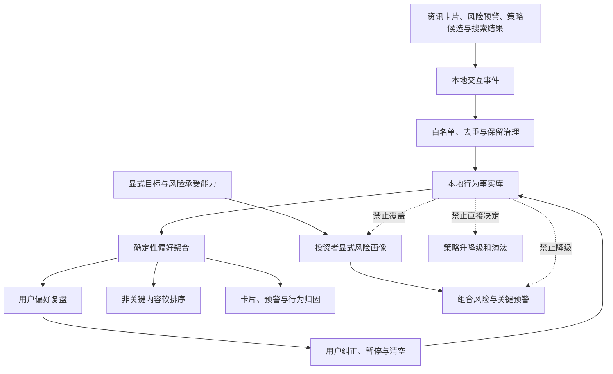

# 本地学习与回输闭环

## 1. 闭环位置

本地行为事实库是现有反馈闭环中的事实补充，不是新的用户身份系统，也不是风险画像的替代品。用户的显式目标、风险承受能力和适当性约束仍是风险决策的唯一用户侧依据。

## 2. 核心对象

### 2.1 本地交互事件

本地交互事件回答“用户在什么产品表面，对哪个归一化对象，执行了哪类产品动作”。事件只包含系统定义字段、服务端时间和匿名会话标识，不携带自由文本。

动作分为页面访问、有效曝光、打开、带入分析、关注和取消关注。反馈使用既有“有用/减少此类”语义并支持最后一次选择覆盖前次选择。

### 2.2 显式反馈

显式反馈的证据强度高于被动曝光和普通打开。反馈是内容偏好信号，不代表用户接受对应风险，也不能使风险事实失效。用户修改选择后，复盘和排序使用最新有效选择，历史不重复计权。

### 2.3 偏好快照

偏好快照是指定时间窗内事件和反馈的确定性聚合，包含规则版本、快照标识、样本量、覆盖天数、结论和置信度。相同输入和规则版本必须得到相同结论，便于复盘与归因。

### 2.4 本地学习设置

本地学习设置至少包含启用状态和保留规则。暂停后不再写入新的行为事件，但用户主动执行的恢复、清空等控制操作仍可完成。清空会删除行为与反馈事实，显式风险资料和业务数据不受影响。

## 3. 证据分层

| 证据 | 含义 | 默认权重边界 |
|---|---|---|
| 有效曝光 | 内容真实进入可视区域 | 仅用于计算曝光基数 |
| 打开 | 用户主动查看对象 | 弱兴趣证据 |
| 带入分析 | 用户将对象带入研究流程 | 中等研究意图证据 |
| 明确“值得关注” | 用户主动保留此类内容 | 强正向内容偏好证据 |
| 明确“减少此类” | 用户主动降低此类内容 | 强负向内容偏好证据 |
| 显式风险问卷与目标 | 用户主动声明的风险约束 | 独立权威来源，不与行为权重混算 |

点击、阅读和分析仅能产生兴趣结论，例如“近期较多研究半导体相关事件”。系统不得据此产生“风险偏好上升”“适合更高波动策略”等结论。

## 4. 复盘输出

复盘页面按 7 天和 30 天展示：记录状态；有效信号数和活跃天数；曝光—打开—分析—反馈漏斗；关注证券、行业和策略；确定性洞察；最近安全活动；显式风险约束的独立摘要。

每条洞察必须显示时间窗、样本量和置信度。有效信号不足 3 个或覆盖不足 2 个自然日时，不生成偏好排行，只显示“数据不足，继续正常使用即可”。百分比在分母不足时不展示。

## 5. 回输边界

偏好快照可用于同风险约束下的非关键资讯软排序、卡片和预警效果归因、用户可见复盘。软排序只能改变相同合规级别内容的展示顺序，不能隐藏强制风险提示、修改风险严重度、突破组合约束或改变策略验证结果。

策略归因可以使用“用户是否查看或分析过该策略”作为参与度背景，但策略升降级和淘汰仍由历史验证、样本外验证、影子运行和真实组合结果决定。

## 6. 用户可控原则

用户应当先看到系统记录了什么和如何得出结论，再决定是否纠正或停止。暂停与清空入口位于“我的投研”的偏好复盘页，不依赖隐藏设置；清空需要二次确认并说明仅影响本地学习记录。
