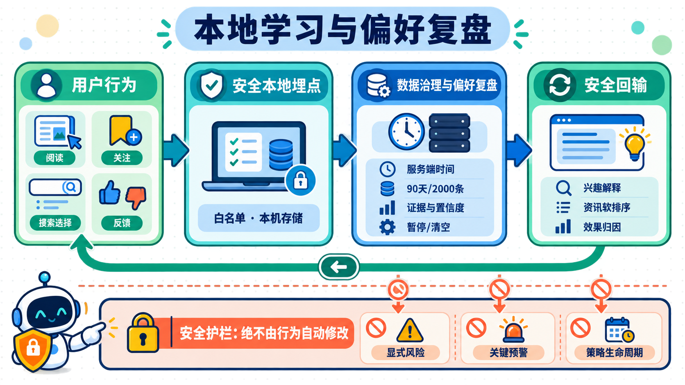

# 投研产品 0.1.0-rc.8 PRD：本地学习与偏好复盘

## 文档状态

| 项目 | 内容 |
|---|---|
| 版本 | 0.1.0-rc.8 |
| 状态 | 功能实现与范围内验证完成，待提交 |
| 版本主题 | 新增本地埋点、用户偏好复盘与安全回输 |
| 产品基线 | [投研产品 0.1.0-rc.7 PRD](../0.1.0-rc.7/README.md) |
| 决策方式 | 用户已授权免除额外人工评审；产品、隐私、算法与回归自审已完成 |

## 版本结论

0.1.0-rc.8 在既有“内容与策略产生—用户阅读和决策—归因—回输”的闭环中补齐本地行为证据层。系统只记录经过白名单约束的产品交互和用户主动反馈，在“我的投研”中把证据、推断规则、样本量和置信度展示给用户，并允许暂停、恢复、纠正和清空。

行为数据只用于解释兴趣、调整非关键内容排序和支持复盘，不得替代用户显式目标与风险承受能力，不得降低关键风险预警，不得直接决定策略升降级或淘汰。

## 视觉资产

### 新功能宣传图

### 新功能原理图

## 文档导航

- [版本目标、范围与指标](00-产品定义/01-版本目标、范围与指标.md)：版本目标、用户价值、范围和成功指标。
- [本地学习与回输闭环](01-产品架构/01-本地学习与回输闭环.md)：产品对象、闭环位置和安全边界。
- [本地学习记录与偏好复盘](02-功能需求/01-本地学习记录与偏好复盘.md)：用户故事、交互规则和验收条件。
- [本地优先、隐私与数据治理](03-横切需求/01-本地优先、隐私与数据治理.md)：数据最小化、保留策略和负面保证。
- [产品验收与回归矩阵](04-验收发布/01-产品验收与回归矩阵.md)：端到端验收、降级和回归范围。
- [需求追踪矩阵](04-验收发布/02-需求追踪矩阵.md)：需求与设计、实现、测试的映射。
- [技术设计](05-研发交付/01-技术设计.md)：数据模型、接口、前后端职责和迁移策略。
- [实现计划与自审](05-研发交付/02-实现计划与自审.md)：实施顺序、自审结论和完成定义。
- [验证报告](05-研发交付/03-验证报告.md)：自动化证据、安全回归、仓库基线问题和交付状态。

## 需求编号

| 前缀 | 含义 |
|---|---|
| `LL` | 本地学习与行为记录 |
| `PR` | 偏好复盘与用户控制 |
| `FB` | 安全回输 |
| `DG` | 数据治理与隐私 |
| `NF` | 非功能要求 |

## 版本门禁

本版本采用以下完成定义：PRD、技术设计和实现计划均已落盘；P0 需求有实现和自动化验证；关键安全负面保证有直接测试；前端可视交互通过组件、GUI 和 Web 组装层回归；后端与运行时完成全量回归；工作区不存在对用户原有改动的覆盖。
