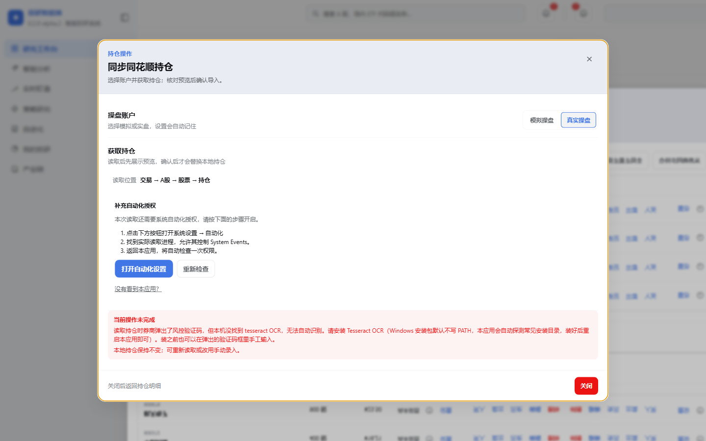

# 券商持仓读取：OCR 缺失前置提醒 — 交付记录

## 结论

**已实现并完成真机渲染验收。** 后端新增两个建议性字段并被动探测 `tesseract`，前端在读取按钮上方渲染一条 warn 提示；OCR 缺失**不阻断**读取。1440 / 1024、浅色 / 深色、键盘路径四种组合均已在真实 Electron + 真实同花顺客户端上验证，正常环境下提示不出现。

## 变更清单

分支：`fix/holdings-ocr-preflight`，基于 `upstream/master`（`75a2a024`，已含 PR #128）。

| 文件 | 改动 |
|---|---|
| `backend/dsh-trading-core/adapter/holdings_providers/_ocr.py` | 拆出无副作用的 `find_tesseract()`；新增 `tesseract_status()`、`missing_tesseract_notice()` |
| `backend/dsh-trading-core/adapter/holdings_source.py` | import `_ocr`；state 字面量加 `captcha_ocr`/`captcha_ocr_hint`；`easytrader` 分支首句探测 |
| `backend/dsh-trading-core/tests/test_easytrader_tesseract.py` | 新增 `PureProbeTests`（5 项） |
| `backend/dsh-trading-core/tests/test_holdings_sync.py` | 新增 `CaptchaOcrAdvisoryTests`（6 项） |
| `frontend/packages/client/ui-investment-research/src/client/WorkbenchOverviewDialog.tsx` | 派生 `ocrMissing` + 提示块（7 行，无 CSS 改动） |
| `frontend/packages/client/ui-investment-research/tests/research-workbench.client.spec.tsx` | 新增 3 项 GUI 测试 |
| `docs/agent-notes/2026-09-18-holdings-captcha-ocr-preflight.md` | Agent Note（新增） |

### 一次基线搬家

改动最初写在工作区（当时 `HEAD` 是未合并的 `ec190fc6`）。落地前发现 PR #128 **已经合并**进 `upstream/master`，于是把改动整体搬到从 `upstream/master` 开的新分支上。

搬家过程中撞到一件事：`upstream/master` 相对 `ec190fc6` 又进了 38 个文件，**其中同步面板被重构成了独立嵌套 dialog**（`持仓明细` → `同步同花顺持仓`），不再是同一个框里换视图。后端四个文件在两版之间完全相同，前端两个文件重新落位后 TSX 的两处 hunk 干净应用，但**我写的 3 个前端测试全挂**——它们还在用旧的 `持仓明细` 对话框句柄查子树。已按上游新写法改为点击后重新取 `view.getByRole('dialog', { name: '同步同花顺持仓' })`。

## 核心约束与它的证据

**OCR 缺失不得把 `available` 置 false、不得禁用读取按钮、不得复用 `dependency_missing`。**

理由是 `easytrader.py` 已注明验证码不是每次必弹；复用致命码既禁掉一个经常可用的功能，又暗示「重装本应用」，而 Tesseract 是用户自己装的三方软件。

真机证据（污染环境）：

```json
{"available": true, "blocking_reason": null,
 "available_actions": ["manual", "recheck", "read", "read_trades"],
 "installation": "installed", "process": "running", "account_mode": "real",
 "captcha_ocr": "missing", "captcha_ocr_hint": "读取时如果券商弹出风控验证码，需要手工输入才能继续。…"}
```

`available_actions` 里 `read` 仍在，`blocking_reason` 为 `null`。界面上「我已打开，开始读取」是可点的实心蓝按钮。

## 真机渲染验收

### 方法

不能靠鼠标注入（前台锁 + 沙箱会静默拒绝）。改用 Chromium DevTools Protocol：`scripts/run-electron.sh dev --profile investment-research --remote-debugging-port=9222`（该脚本用 `exec "$@"` 透传参数），然后经 `127.0.0.1:9222` 用 `Runtime.evaluate` 驱动真实渲染进程、`Emulation.setDeviceMetricsOverride` 切视口、`Input.dispatchKeyEvent` 发真实 Tab 键、`Page.captureScreenshot` 截图。

这样拿到的是**真实产品的真实渲染**，不是 jsdom。DOM 断言（`role=note`、`disabled`、`getBoundingClientRect`、`getComputedStyle`）与截图互为佐证。

### 如何制造「OCR 缺失」

本机装了 Tesseract（`%ProgramFiles%\Tesseract-OCR`），默认探测为 `available`。用环境变量把候选目录指空：

```bash
ProgramFiles='C:\__no_ocr__' ProgramW6432='C:\__no_ocr__' \
  bash scripts/run-electron.sh dev --profile investment-research --remote-debugging-port=9222
```

`shutil.which("tesseract.exe")` 在本机 PATH 上本来就是 `None`，唯一命中来自这两个变量；`expandvars` 会替换、`is_file()` 为假，7 个候选全落空，**不需要真建目录**。侧车不洗环境变量（`subprocess-local/src/spawn.ts:36-49` 只过滤 `KEY|PASSWORD|SECRET|TOKEN` 和 `DSH_*`），所以 env 能透传到 Python 层。

### 环境

- 日期：2026-09-18
- 宿主：Windows 11 Home China 10.0.26200，Electron 43.2.0 / Chromium 150
- 应用：投研智能体 0.2.0-alpha.2，`dev` 模式，profile `investment-research`
- 券商：同花顺客户端**正在运行**（`installation=installed`、`process=running`），操盘账户 `real`
- 持仓数据：本地 4 只研究持仓（400 股 @¥7.45 / 6,800 股 @¥1.0115 / 400 股 @¥16.2117 / 900 股 @¥23.5024）。**验收前后逐条核对过，数量和成本完全一致**——其中一次意外触发了真实读取并失败（见下），失败路径不写本地持仓
- 主题：应用内主题切换按钮（`aria-label="当前浅色模式，切换为深色模式"`）

### 结果矩阵

| 视口 | 主题 | 提示 | 读取按钮 | 按钮 disabled | 横向溢出 | 截图 |
|---|---|---|---|---|---|---|
| 1440×900 | 浅色 | 是 | 「我已打开，开始读取」 | 否 | 无 | [ocr-1440-light.png](assets/2026-09-18-holdings-ocr-preflight/ocr-1440-light.png) |
| 1440×900 | 深色 | 是 | 同上 | 否 | 无 | [ocr-1440-dark.png](assets/2026-09-18-holdings-ocr-preflight/ocr-1440-dark.png) |
| 1024×768 | 浅色 | 是 | 同上 | 否 | 无 | [ocr-1024-light.png](assets/2026-09-18-holdings-ocr-preflight/ocr-1024-light.png) |
| 1024×768 | 深色 | 是 | 同上 | 否 | 无 | [ocr-1024-dark.png](assets/2026-09-18-holdings-ocr-preflight/ocr-1024-dark.png) |
| 1440×900 | 浅色，**正常环境** | **否** | 存在且可点 | 否 | 无 | [ocr-1440-light-normal.png](assets/2026-09-18-holdings-ocr-preflight/ocr-1440-light-normal.png) |

提示盒实测：`role="note"`，`<strong>` 为「本机未找到 OCR，验证码可能需要手工输入」。1440 下 `getBoundingClientRect()` 为 `[220, 511, 1000, 78]`，1024 下为 `[45, 445, 934, 78]`，两档 `document.documentElement.scrollWidth <= innerWidth`（无横向溢出）。浅色 computed `background-color: rgb(254,245,231)`、深色 `rgb(39,36,31)`，两者 `color` 均为 `rgb(221,134,41)`——即 `--dsw-alias-state-warn-*` 在两种主题下都生效，未回退字面色。

正常环境负面对照：同一屏、同一操作路径下 `panel.querySelectorAll('[role=note]').length === 0`，后端 `captcha_ocr="available"`、`captcha_ocr_hint=null`。

### 键盘路径

`Input.dispatchKeyEvent` 真发 Tab，`document.activeElement` 轨迹：

```
BUTTON:模拟操盘|disabled=false
BUTTON:真实操盘|disabled=false
BUTTON:我已打开，开始读取|disabled=false   ← 3 次 Tab 到达，未跳过，未禁用
```

走完后复查：提示仍在（`note: true`）、未误触读取（`errorBanner: false`）。

**注意**：这一项的证据是 DOM 焦点轨迹，不是截图。同一状态下的截图与未走键盘的截图**逐字节相同**（`md5sum` 一致），说明焦点环没有进入 `Page.captureScreenshot` 的输出，截图不能用来证明键盘可达性——所以相关截图已删除，不留无效证据。

### 意外收获：失败态是真实可达的，而且文案确实被错分类了

验收过程中有一次意外触发了真实读取（按键走位导致），客户端弹出验证码、本机无 OCR，于是拿到了失败态的真实渲染：



两条结论：

1. **好消息**：banner 正文是 OCR 专属文案「读取时券商弹出了风控验证码，但本机没找到 tesseract OCR，无法自动识别…」——PR #128 修的「说人话」在真机上确实生效。
2. **坏消息（既有问题，本次未动）**：这个失败被渲染成了**「补充自动化授权 / 打开自动化设置」**，那是 macOS 的辅助功能流程，在 Windows 上指引用户去点一个没有意义的按钮。这正是「OCR 失败被归为 `automation_required`，前端再折成 `permission`」这条既有链路的结果。本次只做读取前提醒、不碰失败态分类，修它属于另一件事——但现在有截图了。
3. 同屏确认：失败后提示盒与读取按钮都消失，只剩失败 banner，没有出现两条原因并存。

### 局限

- **没有主动点击过读取按钮**。上面那次读取是按键走位意外触发的，不是有意驱动。因此「读取成功后 `preview` 出现、提示消失」这条只有 jsdom 覆盖，没有真机覆盖。
- 视口是经 CDP `Emulation.setDeviceMetricsOverride` 设定的，不是把窗口拖到 1440/1024。渲染确实发生在真实渲染进程里，但窗口物理尺寸仍是 1152 宽。
- 真机只跑了 Windows。macOS 分支的提示条件显式排除 `darwin`，本轮未在 mac 上验证。
- 每一次 CDP 截图都要求窗口处于可绘制状态；`Page.captureScreenshot` 在目标消失时**不会返回也不会报错**（挂住），本轮遇到过两次，靠人工判断进程存活后重试。

## 自动化证据

- 后端：`test_easytrader_tesseract` 16 项通过（原 11 项 + 新增 `PureProbeTests` 5 项；其中 4 项 `locate_tesseract` 旧测试**零改动**通过，是「重构无行为变化」的证明）。`test_easytrader_tesseract` + `test_holdings_sync` + `test_trades_capability` + `test_mac_ths` 合计 118 项 `OK`，含新增 `CaptchaOcrAdvisoryTests` 6 项。
- 前端：`research-workbench.client.spec.tsx` 59 项全绿，含新增 3 项（缺失时提示出现且两个按钮都不 disabled / `available` 与字段缺失两种情况下都不提示 / `client_not_running` 时不提前报 OCR）。

## 仓库基线红灯（**非本次引入，按要求记录而非静默修复**）

已用 `git stash push` 抹掉本次全部改动后复现同样的红灯，确认是既有基线：

- `pnpm run test:gui`：10 failed / 6 个文件（ui-agent-preset、ui-directory-picker-browse、ui-primitives、ui-settings-models、ui-theme、ui-trajectory）。**失败文件没有一个属于 `ui-investment-research`**。
- `pnpm run verify-client-theme-styles`：失败，违规点在同批既有文件（ProductPages、ResearchContextControls、`KycProfilePanel.module.css` 滚动条断言）。本次**没有新增任何 CSS**，变更文件不在违规清单里。
- `test_holdings_preview`：2 项失败（1 error + 1 failure），stash 后同样失败。

按 `frontend/packages/client/AGENTS.md` 的要求在此记录，不静默修复也不忽略。

## 未验证项 / 未做项

- `pytesseract` 不可导入这个独立故障模式未覆盖，见 Agent Note。
- 读取时 OCR 失败仍被归为 `automation_required`、前端渲染 macOS 味道的引导——既有问题，本次未动，但现在有真机截图。
- 打包链路未动：Tesseract 仍然**不随产品分发**，缺 OCR 的机器现在能提前看到提示，但仍需要用户自己安装。
